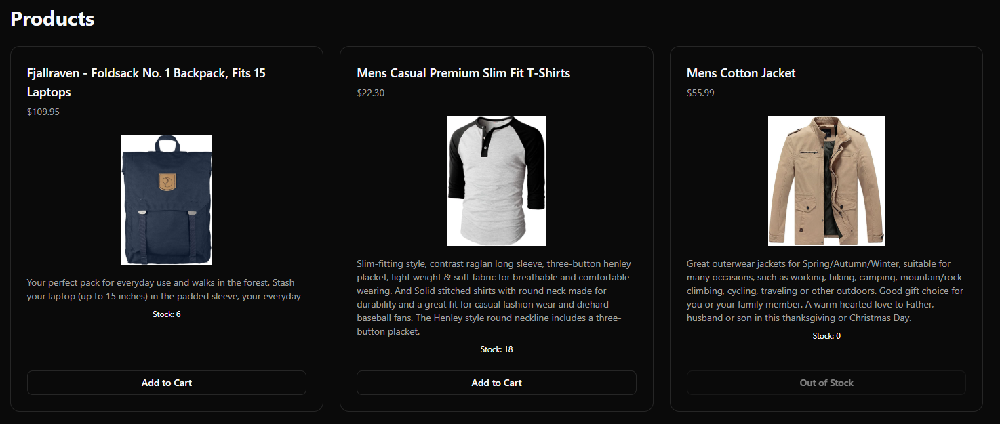
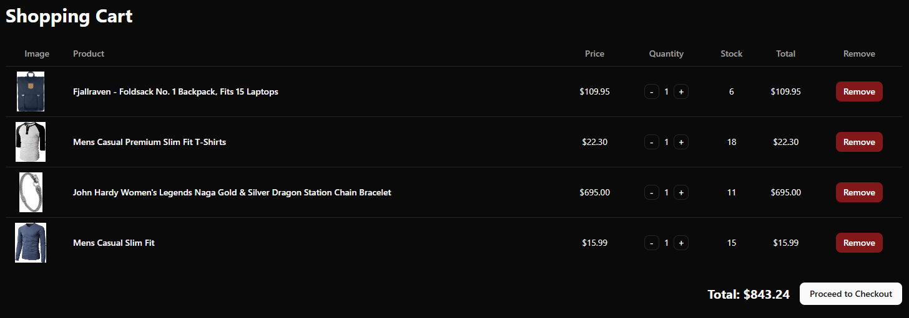
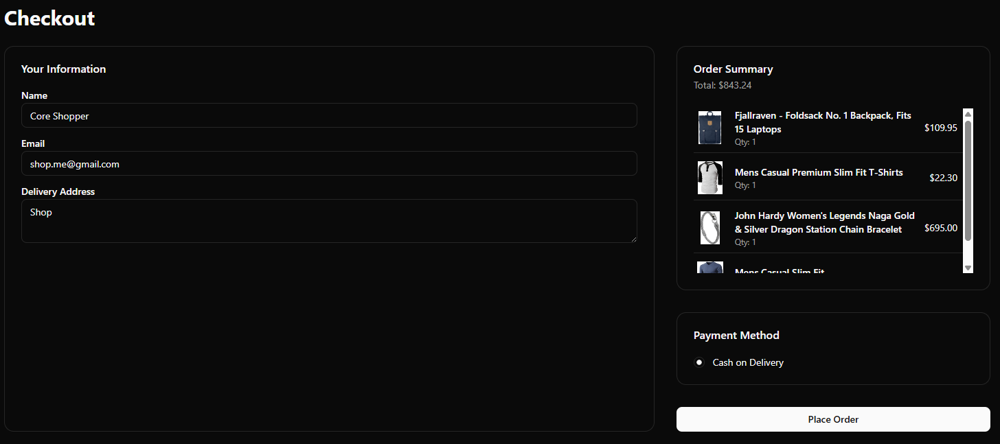
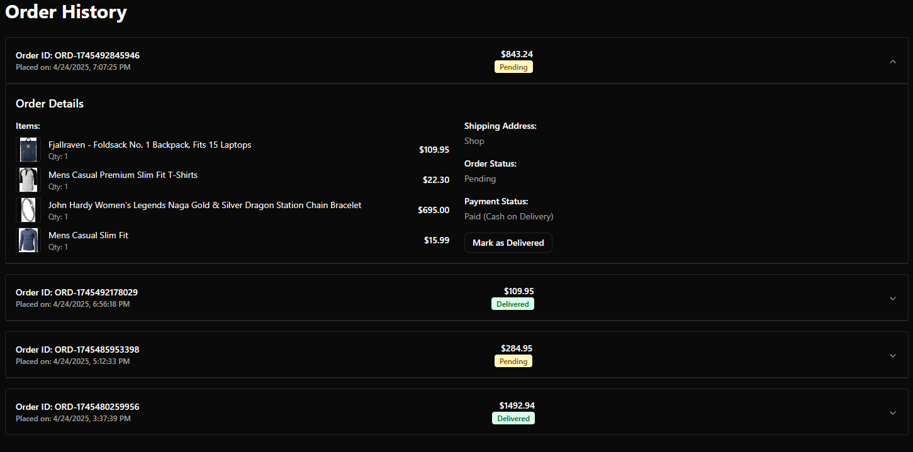

# Microfrontend Shop Showcase

<div align="center">
    <a href="https://core-mfe-shop.vercel.app/" target="_blank" rel='noreferrer'>Microfrontend Shop</a><br/>
    <a href="https://core.thecodebit.digital/" target="_blank" rel='noreferrer'>Core Components Landing Page</a><br>
    <a href="https://core.thecodebit.digital/remoteEntry.js" target="_blank" rel='noreferrer'>Core Components Remote Entry</a><br>
    <a href="https://www.npmjs.com/package/@bernz322/core" target="_blank" rel='noreferrer'>Core Components NPM Package</a><br>
    <a href="https://jeffreybernadas.github.io/core/" target="_blank" rel='noreferrer'>Core Components Storybook</a><br/>
</div>
<br />

This project demonstrates the capabilities of the [Core Components](https://core.thecodebit.digital/) in building a simple modular e-commerce application using microfrontend architecture.

## Overview

A showcase shop application built with microfrontends, demonstrating how to effectively use shared components, hooks, and utilities from a centralized core library. The application features product listings, cart management, checkout functionality, order, and state management, all powered by independent microfrontends.

## Live Demo

- Deployed: [https://core-mfe-shop.vercel.app/](https://core-mfe-shop.vercel.app/)

## Technical Stack

- **Framework**: React.js + TypeScript
- **Module Federation**: Rspack
- **Routing**: React Router
- **State Management**: Redux Toolkit
- **Styling**: Tailwind CSS
- **Core Components**: @core/components (shadcn/ui)
- **Shared Utilities**: @core/hooks, @core/utils

## Microfrontends Architecture

### 1. App Shell (Container)

- **Folder**: `/app-shell`
- **Live Demo**: [https://core-mfe-shop.vercel.app/](https://core-mfe-shop.vercel.app/)
- **Port**: 9500
- **Responsibilities**:
  - Hosts all microfrontends
  - Manages routing
  - Contains navbar

### 2. Product List

- **Folder**: `/products`
- **Live Demo**: [https://core-mfe-products.vercel.app/](https://core-mfe-products.vercel.app/)
- **Port**: 9501
- **Features**:
  - Product grid display
  - Display product details
  - Add to cart functionality
  - Mock product data integration

### 3. Cart (Dropdown)

- **Folder**: `/cart`
- **Live Demo**: [https://core-mfe-cart.vercel.app/](https://core-mfe-cart.vercel.app/)
- **Port**: 9502
- **Features**:
  - Display cart items (products)
  - Item quantity management (increment, decrement)
  - Total price calculation
  - Checkout navigation

### 4. Checkout

- **Folder**: `/checkout`
- **Live Demo**: [https://core-mfe-checkout.vercel.app/](https://core-mfe-checkout.vercel.app/)
- **Port**: 9503
- **Features**:
  - Checkout form (user information)
  - Order summary
  - Payment process (mock)

### 5. Order Confirmation

- **Folder**: `/order`
- **Live Demo**: [https://core-mfe-order.vercel.app/](https://core-mfe-order.vercel.app/)
- **Port**: 9504
- **Features**:
  - Order details display
  - Order tracking info
  - Order history
  - See and update order status

### 6. State Management

- **Folder**: `/state-management`
- **Live Demo**: [https://core-mfe-states.vercel.app/](https://core-mfe-states.vercel.app/)
- **Port**: 9505
- **Features**:
  - Centralized Redux store (Redux Toolkit)
  - Cart state management
  - Product state management
  - Checkout state management
  - Order state management

## Getting Started

### Prerequisites

```bash
node >= 20.0.0
npm >= 10.0.0
```

### Installation

1. Clone the repository:

```bash
git clone https://github.com/jeffreybernadas/microfrontend-cart.git
cd microfrontend-cart
```

2. Install dependencies for each microfrontend:

```bash
cd app-shell
npm install

cd cart
npm install

cd checkout
npm install

cd order
npm install

cd products
npm install

cd state-management
npm install
```

3. Install concurrently and start the development servers:

```bash
npm install -g concurrently

cd microfrontend-cart

npm start
```

## Project Structure

```
├── app-shell/              # Container application
├── cart/                   # Cart management microfrontend
├── checkout/               # Checkout process microfrontend
├── order/                  # Order confirmation microfrontend
├── products/               # Product listing microfrontend
├── state-management/       # State management microfrontend
```

## Screenshots

### App Shell


### Product List MFE



### Cart MFE



### Checkout MFE



### Order MFE



## Core Components Integration

All UI components are imported from the Core Module Federation:

```typescript
// Example of importing core components
import { Button, Card } from "@core/components/shadcn";
import { useDebounce } from "@core/hooks";
import { format } from "@core/lib";
```

## Routes

### Local Development

- App Shell: http://localhost:9500
- Product List: http://localhost:9501
- Cart: http://localhost:9502
- Checkout: http://localhost:9503
- Order Confirmation: http://localhost:9504
- State Management Store: http://localhost:9505

### Deployed Routes

- App Shell: https://core-mfe-shop.vercel.app/
- Product : https://core-mfe-products.vercel.app/
- Cart: https://core-mfe-cart.vercel.app/
- Checkout: https://core-mfe-checkout.vercel.app/
- Order Confirmation: https://core-mfe-order.vercel.app/
- State Management Store: https://core-mfe-states.vercel.app/

## Performance Considerations

- Lazy loading of microfrontends
- Shared dependencies management
- Optimized bundle sizes
- Efficient state management

## Key benefits of using Microfrontends

#### Independent Development & Deployment
- Teams can work autonomously on different features.
- Each microfrontend can be deployed independently like this repository, each of them are deployed in different Vercel apps.
- No need to coordinate releases across the entire application.
- Faster time-to-market for new features.
- Reduced deployment risks with smaller, focused updates.

### Technology Freedom
- Although not shown in this repository, teams can choose their preferred tech stack within agreed constraints.
- Easier to adopt new technologies gradually.
- Legacy code can be modernized piece by piece.
- Framework-agnostic approach possible through Module Federation.

### Scalability & Maintenance
- Smaller, more manageable codebases
- Easier to understand and maintain
- Reduced risk of breaking changes
- Better fault isolation
- Simplified debugging and testing

### Team Organization
- Align teams with business domains (e.g., cart team, checkout team)
- Clear ownership and responsibilities
- Reduced merge conflicts
- More efficient code reviews
- Better team autonomy and accountability

### Development Experience
- Faster local development (only run needed MFEs)
- Independent testing environments
- Easier debugging and troubleshooting
- Simplified CI/CD pipelines per microfrontend
- Improved development velocity

### Business Benefits
- Faster feature delivery
- Reduced time-to-market
- Better resource allocation
- Improved team productivity
- More flexible scaling of development teams
